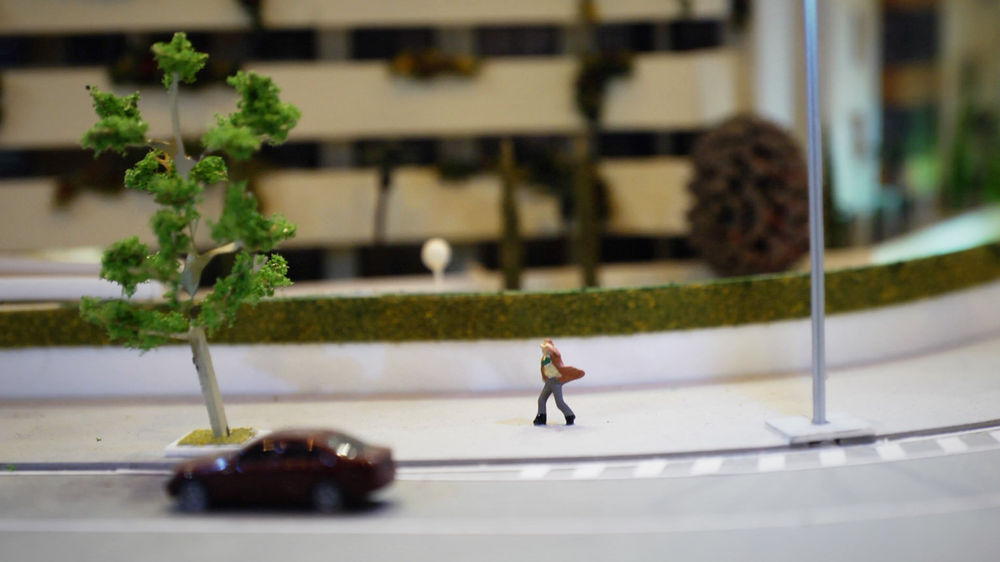

# La Grieta
## Una película de Irene Yagüe Herrero y Alberto García Ortiz

---

**La Grieta** retrata la lucha de dos vecinas por conservar sus casas en un edificio de protección oficial en Villaverde, un barrio obrero de Madrid.

Corre el año 2013 cuando los fondos de inversión aterrizan en España atraídos por las gangas inmobiliarias que los gobiernos locales ponen a la venta.

**La Grieta** revela la compleja realidad de estas familias mercheras, un retrato que no solo se centra en la lucha por un techo, sino también en el sentido de identidad y pertenencia a una comunidad.

---

### Ficha Técnica

+ Duración 78’
+ País de producción ESPAÑA
+ Año 2017
+ Formato HD
+ Género DOCUMENTAL
+ V.O CASTELLANO e INGLÉS
+ Subtítulos ESPAÑOL e INGLÉS

### Créditos

+ Dirección IRENE YAGÜE y ALBERTO G. ORTIZ
+ Fotografía ALBERTO G. ORTIZ
+ Sonido Directo IRENE YAGÜE
+ Mezcla de Sonido PATRICK GHISLAIN
+ Etalonaje MANUEL DÁVILA
+ Producción IRENE YAGÜE y ALBERTO G. ORTIZ
+ Asistentes Producción MARÍA VERA y AGATHA MACIASZEK
+ Montaje ALBERTO G. ORTIZ
+ Ayudantes Montaje IRENE YAGÜE y AGATHA MACIASZEK
+ Música EL LUISITO
+ Cartel JULIEN CHARLON

---

+ Web Construida con [Jekyll](https://jekyllrb.com/)
+ Los iconos de [Font Awesome](http://fontawesome.io)
